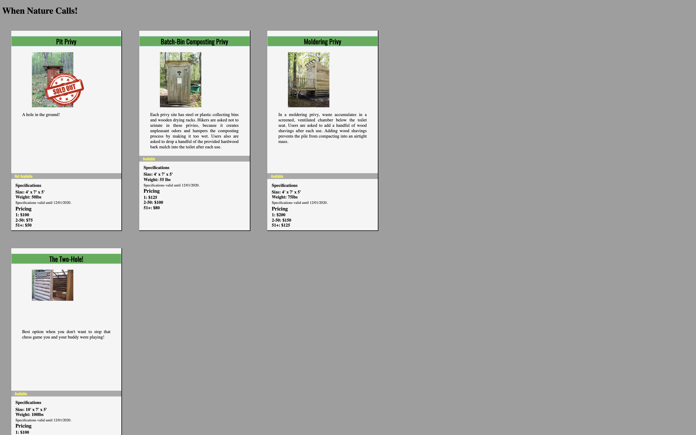

# Product-Cards & Privies

## Description
This project is an exploration into using HTML and CSS to display a grid of several items, with data about and images of these items. When Nature Calls provides details about several popular privy styles. The project introduces new features, such as adding new Google fonts and overlaying images. Project instructions can be found [here](https://github.com/nss-nightclass-projects/exercise-vault/blob/master/HTML_CSS_product_cards.md). 

## Screenshots
##### Home Page

## How to Run
1. Clone down this repo.
1. Make sure you have http-server installed via npm. If not, get it [here](https://www.npmjs.com/package/http-server).
1. On your command line, run `hs -p 9999`.
1. In your browser, navigate to `http://localhost:9999`.
